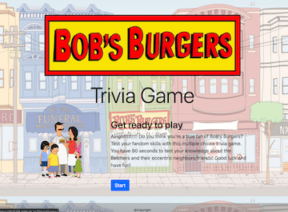
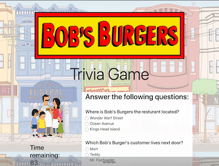
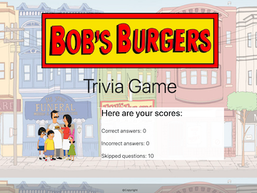

# Bob's Burgers Trivia Game
In this assignment I created a Trivia game to test a users knowledge on the fox hit tv show Bob Burgers.  This game is a multiple choice trivia game where the user gets an answer bank of three possible solutions. 

You can play online at https://jk1138.github.io/TriviaGame/.

##Game rules
When click the start button you will be given 10 multiple choice questions ( in the future I hope to add additional questions) covering different questions about the likes and dislikes of the characters on the show. The client has 90 seconds to answer all the questions before time runs out but otherwise, once you are done completing the quiz you can just click "done". At the end of the game the clients score will be displayed in the browser pages. The score will consist of answered correctly, incorrectly, and incomplete. 

##What was used:
This Trivia game was created by using JavaScript for the logic and jQuery to manipulate HTML. I also used HTML and CSS along with Bootstrap to help create a fun and dynamic html page. 

